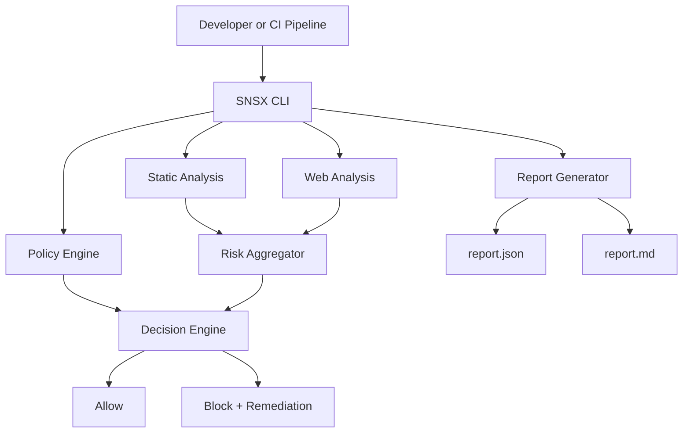
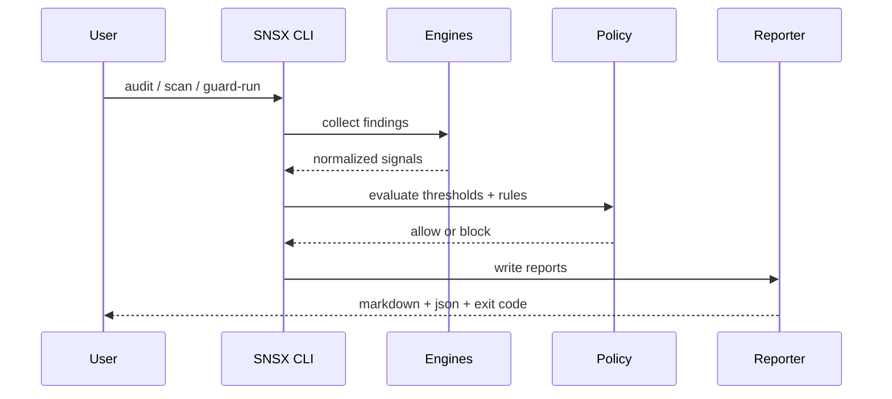

# SNSX Cyber Reasoning System (SNSX CRS)
**Crafted and Developed by Satya Narayan Sahu**
Security-first, policy-driven cyber reasoning platform for authorized code and web security assessment.

## What This Project Is...

SNSX CRS helps engineering and security teams prevent risky code from shipping by combining:

- static security analysis
- authorized web surface checks
- profile-based risk gating (`standard`, `strict`, `paranoid`)
- guard-mode execution that blocks unsafe runs
- machine and human readable remediation reports

## Who Should Use It

- application security teams
- platform/devsecops teams
- security-focused developers
- authorized security researchers in approved scope

## Legal and Ethics

Use SNSX only on systems you own or are explicitly authorized to test.

Do not run unauthorized scans.

---

## Core Capabilities

- deterministic source code security checks
- web-target security signal collection (authorized URLs)
- finding normalization and risk scoring
- policy-based allow/block decision engine
- remediation guidance generation
- CI/CD gate integration
- traceable artifacts for audit and governance

---

## Architecture

### Execution Flow

---

## Repository Layout

- `acrs/core` - CLI, pipeline orchestration, config, schemas
- `acrs/analysis` - security analyzers and scanners
- `acrs/api` - service wrapper endpoints
- `acrs/sandbox` - controlled execution helpers
- `acrs/fuzzing` - fuzzing components
- `acrs/knowledge_graph` - reasoning graph utilities
- `acrs/dashboard` - frontend/backend dashboard assets
- `acrs/docs` - additional technical docs

---

## Quick Start

### Prerequisites

- Python 3.11+ (3.12 recommended)
- Git

### Install

~~~bash
git clone <REPO_URL> ~/tools/snsx
cd ~/tools/snsx
python3 -m venv .venv
source .venv/bin/activate
pip install -e .
~~~

### Verify

~~~bash
snsx --help
snsx audit --path . --profile strict --min-severity low
~~~

---

## First End-to-End Run

### 1. Create policy

Create `.snsx/policy.json`:

~~~json
{
  "required_checks": ["tests", "lint"],
  "banned_patterns": ["eval(", "subprocess.Popen(shell=True"],
  "required_headers": ["content-security-policy", "x-content-type-options"],
  "min_severity": "low",
  "profiles": {
    "standard": {"threshold": 60},
    "strict": {"threshold": 40},
    "paranoid": {"threshold": 25}
  }
}
~~~

### 2. Run audit

~~~bash
snsx audit --path /absolute/path/to/project --profile strict --min-severity low
~~~

### 3. Guard your tests

~~~bash
snsx guard-run --path /absolute/path/to/project --profile strict --min-severity low -- pytest -q
~~~

### 4. Run full scan with authorized URL

~~~bash
snsx scan \
  --path /absolute/path/to/project \
  --target-url https://authorized-target.example \
  --profile strict \
  --min-severity low
~~~

---

## CLI Commands

### `audit`

Analyze local source code and emit findings + risk decision.

~~~bash
snsx audit --path . --profile strict --min-severity low
~~~

### `scan`

Analyze local code and authorized web target signals.

~~~bash
snsx scan --path . --target-url https://authorized.example --profile strict --min-severity low
~~~

### `guard-run`

Run a command only when policy and risk gates pass.

~~~bash
snsx guard-run --path . --profile strict --min-severity low -- npm test
~~~

### `watch`

Continuous feedback loop while developing.

~~~bash
snsx watch --path . --profile strict
~~~

---

## Risk Model

SNSX computes total risk from:

- severity
- confidence
- exploitability
- policy penalties

Conceptual model:

`R_total = sum(severity * confidence * exploitability) + policy_penalty`

Decision:

- allow if `R_total < threshold(profile)`
- block if `R_total >= threshold(profile)`

---

## Output Artifacts

Typical output directory contains:

- `report.json` - machine-friendly finding details
- `report.md` - human-friendly report and remediation

Example finding payload:

~~~json
{
  "id": "SNSX-F-001203",
  "category": "Injection",
  "title": "Potential command injection via unsanitized input",
  "severity": "high",
  "confidence": "medium",
  "file": "src/runner.py",
  "line": 118,
  "evidence": "subprocess.run(user_input, shell=True)",
  "remediation": "Use argument-list execution and strict input allowlist"
}
~~~

---

## Integration Examples

### Python wrapper

~~~python
import subprocess

def run_snsx(path: str, profile: str = "strict") -> dict:
    cmd = ["snsx", "audit", "--path", path, "--profile", profile, "--min-severity", "low"]
    proc = subprocess.run(cmd, capture_output=True, text=True, check=False)
    return {
        "exit_code": proc.returncode,
        "stdout": proc.stdout,
        "stderr": proc.stderr,
        "path": path,
        "profile": profile,
    }
~~~

### FastAPI endpoint

~~~python
from fastapi import FastAPI, HTTPException
import subprocess

app = FastAPI()

@app.post("/security/audit")
def security_audit(path: str, profile: str = "strict"):
    cmd = ["snsx", "audit", "--path", path, "--profile", profile, "--min-severity", "low"]
    proc = subprocess.run(cmd, capture_output=True, text=True, check=False)

    if proc.returncode not in (0, 1):
        raise HTTPException(status_code=500, detail="SNSX execution failure")

    return {
        "exit_code": proc.returncode,
        "stdout": proc.stdout,
        "stderr": proc.stderr,
    }
~~~

---

## CI/CD Example (GitHub Actions)

~~~yaml
name: snsx-security-gate
on:
  pull_request:
  push:
    branches: ["main", "release/*"]

jobs:
  security:
    runs-on: ubuntu-latest
    steps:
      - uses: actions/checkout@v4
      - uses: actions/setup-python@v5
        with:
          python-version: "3.12"
      - name: install
        run: |
          python -m venv .venv
          source .venv/bin/activate
          pip install -e .
      - name: audit
        run: |
          source .venv/bin/activate
          snsx audit --path . --profile strict --min-severity low
      - name: guarded-tests
        run: |
          source .venv/bin/activate
          snsx guard-run --path . --profile strict --min-severity low -- pytest -q
~~~

Recommended release policy:

- PR: `strict`
- pre-release: `paranoid`
- production release: `paranoid` + approval record

---

## Testing Strategy

### Unit testing

~~~python
from analysis.security_audit.engine import run_security_audit

def test_eval_is_detected(tmp_path):
    p = tmp_path / "bad.py"
    p.write_text("x=input(); y=eval(x)")
    findings = run_security_audit(str(tmp_path), "strict")
    assert any("eval" in f.title.lower() for f in findings)
~~~

### Integration testing

~~~bash
set -euo pipefail
snsx audit --path ./fixtures/vulnerable --profile strict --min-severity low || true
snsx audit --path ./fixtures/fixed --profile strict --min-severity low
~~~

### Regression testing

~~~python
def test_no_secret_leaks(scanner, project_path):
    findings = scanner.run(path=project_path, profile="strict")
    assert not [f for f in findings if "secret" in f.category.lower()]
~~~

---

## Security and Privacy Standards

### Secret handling

- use vault/env vars for credentials
- never hardcode secrets in repository
- always redact logs and reports

### Identity protection

Use masked formats only in docs/artifacts:

- researcher name: `S**** N****** S***`
- alias: `SNSX-RSRCH-****-A91`
- token: `snsx_tok_**************************7f2a`
- incident code: `IR-OPS-****-KOL-09`

---

## Operations Runbooks

### Blocked build

1. open latest `report.md` and `report.json`
2. prioritize critical/high findings
3. patch and add regression tests
4. rerun `audit` and `guard-run`
5. attach evidence to change request

### False positive

1. validate finding evidence and code context
2. reproduce in isolated fixture
3. document suppression rationale
4. get security maintainer approval

### Incident support

1. freeze release pipeline
2. run paranoid profile on impacted services
3. remediate, retest, and document closure

---

## Observability

Recommended run metadata fields:

- `trace_id`
- `run_id`
- `profile`
- `decision`
- `blocking_count`
- `target`

Recommended metrics:

- `snsx_runs_total`
- `snsx_blocked_runs_total`
- `snsx_findings_total`
- `snsx_mean_time_to_remediate_hours`

---

## Troubleshooting

### Command not found

~~~bash
source .venv/bin/activate
which snsx
snsx --help
~~~

### Unexpected block

- verify policy threshold and selected profile
- inspect exact finding evidence in report
- rerun in clean environment

### Web scan failures

- verify DNS/TLS reachability
- confirm authorized scope and network access
- validate URL correctness

---

## Contribution Guidelines

For production-grade contributions:

- keep changes small and reviewable
- include tests for behavior changes
- include security rationale for policy/rule changes
- update docs when command or schema changes

---

## Intellectual Property and Attribution

Reference attribution includes Satya Narayan Sahu in documentation context.

Suggested legal notice:

~~~text
Copyright (c) 2025 Satya Narayan Sahu.
All rights reserved.

Architecture descriptions, workflow models, and documentation structure
are protected intellectual property unless explicitly licensed.
~~~

---

## Roadmap (Short)

- richer policy DSL and rule packs
- more language-specific analyzers
- deeper trend analytics and dashboards
- signed artifact provenance support

---

## Final Notes

This Entire Project is basically focused on the security factor of the tech projects which helps the developer analyse the lacks in the security in their program's workflow.
Sensitive identities and secrets are masked by design.
