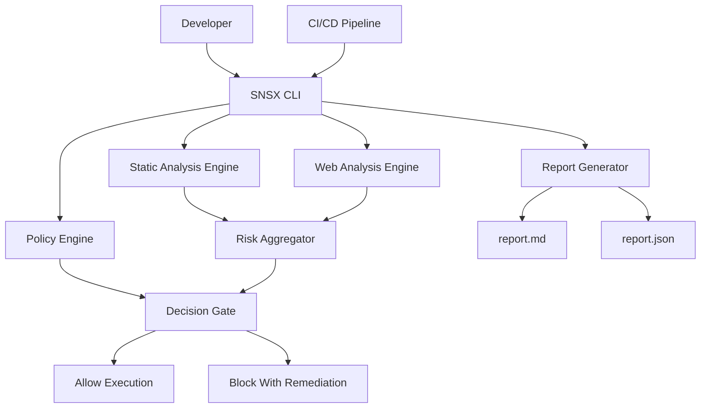
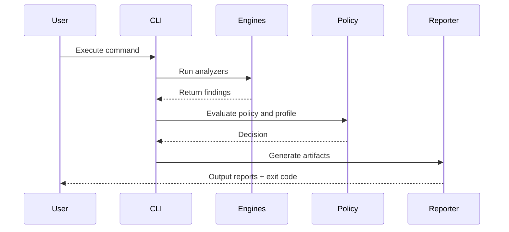

# SNSX Cyber Reasoning System (SNSX CRS)

## Software Technical Specification

Document ID: SNSX-STS-002

Version: 1.0.0

Status: Released for Company Submission

Prepared For: Engineering, Application Security, Platform Operations, Governance, Audit

Prepared By: SNSX Documentation Team, SAACH INDIA (Satya Narayan Sahu, Tathoi Mondal)

Attribution Reference: Satya Narayan Sahu

---

## 1. Document Purpose

This document defines the formal technical specification for SNSX Cyber Reasoning System (SNSX CRS). It describes architecture, interfaces, requirements, controls, workflows, verification strategy, operational model, and acceptance criteria required for enterprise deployment and governance.

This specification is written for production implementation and formal review workflows.

---

## 2. Scope

SNSX CRS provides policy-driven security analysis for authorized software and web targets. The system executes security checks, computes risk decisions, blocks unsafe operations when configured, and emits structured remediation artifacts.

In scope:

- code security analysis
- authorized web security analysis
- policy-based risk gating
- guard-run command enforcement
- report generation for engineering and audit
- CI/CD integration
- observability and operational controls

Out of scope:

- unauthorized security testing
- offensive activity without legal authorization
- full replacement of manual penetration testing

---

## 3. Normative Language

The terms SHALL, SHALL NOT, SHOULD, SHOULD NOT, and MAY are used according to standard requirements writing practice.

- SHALL indicates mandatory behavior.
- SHOULD indicates recommended behavior.
- MAY indicates optional behavior.

---

## 4. Definitions

- Finding: normalized security issue generated by an analysis engine.
- Policy: machine-readable configuration defining mandatory checks and thresholds.
- Profile: named risk threshold set (`standard`, `strict`, `paranoid`).
- Gate Decision: allow or block result from policy and risk evaluation.
- Remediation Artifact: structured fix guidance produced from findings.

---

## 5. System Context

System boundaries:

- inbound: source code path, authorized URL, policy/profile
- outbound: decision, exit code, reports, logs, metrics

---

## 6. Architectural Specification

### 6.1 Logical Components

1. Interface Layer
- CLI entrypoint
- API adapters
- CI wrapper scripts

2. Orchestration Layer
- command parsing
- engine execution order
- result collation

3. Analysis Layer
- static analyzers
- web analyzers
- optional specialized analyzers

4. Policy and Decision Layer
- policy parsing
- threshold evaluation
- gating outcome generation

5. Reporting Layer
- markdown report writer
- json report writer
- remediation composer

6. Operations Layer
- logs and metrics
- runbook hooks
- evidence retention controls

### 6.2 Sequence Specification

### 6.3 Deployment Views

Local deployment:
- developer workstation with Python runtime and CLI.

Central CI deployment:
- ephemeral CI worker with project checkout and SNSX runtime.

Hybrid enterprise deployment:
- local pre-checks plus centralized paranoid release gates.

---

## 7. Functional Requirements

### 7.1 CLI Requirements

FR-CLI-001
- The system SHALL expose a CLI command `snsx` with subcommands for `audit`, `scan`, `guard-run`, and `watch`.

FR-CLI-002
- The `audit` command SHALL analyze local source code path input.

FR-CLI-003
- The `scan` command SHALL analyze local source code and authorized web target input.

FR-CLI-004
- The `guard-run` command SHALL evaluate security state before executing delegated commands.

FR-CLI-005
- The CLI SHALL return deterministic exit codes for pass/fail/error states.

FR-CLI-006
- The CLI SHALL support absolute paths and paths containing spaces.

### 7.2 Policy Requirements

FR-POL-001
- The system SHALL load policy configuration from `.snsx/policy.json` when present.

FR-POL-002
- The policy engine SHALL support profile thresholds for `standard`, `strict`, and `paranoid`.

FR-POL-003
- The policy engine SHALL enforce required checks, banned patterns, and minimum severity constraints.

FR-POL-004
- Policy parsing failures SHALL be reported as explicit configuration errors.

FR-POL-005
- Policy override behavior SHALL be auditable via logs.

### 7.3 Analysis Requirements

FR-ANL-001
- The analysis layer SHALL normalize findings into a common schema.

FR-ANL-002
- Findings SHALL include category, severity, evidence location, and remediation guidance fields.

FR-ANL-003
- The web analysis module SHALL only process authorized target URLs.

FR-ANL-004
- Analysis execution SHALL support profile-sensitive filtering.

FR-ANL-005
- Analyzer runtime failures SHALL not silently pass the gate decision.

### 7.4 Decision Requirements

FR-DEC-001
- The decision engine SHALL compute `R_total` from normalized findings and policy penalties.

FR-DEC-002
- The decision engine SHALL compare `R_total` against selected profile threshold.

FR-DEC-003
- If `R_total` is greater than or equal to threshold, decision SHALL be BLOCK.

FR-DEC-004
- If `R_total` is below threshold, decision SHALL be ALLOW.

FR-DEC-005
- The decision payload SHALL include rationale and blocking reason count.

### 7.5 Reporting Requirements

FR-REP-001
- The system SHALL generate a markdown report (`report.md`).

FR-REP-002
- The system SHALL generate a json report (`report.json`).

FR-REP-003
- Reports SHALL include finding identifiers and remediation guidance.

FR-REP-004
- Reports SHALL redact sensitive values according to masking policy.

FR-REP-005
- Reports SHALL be traceable to run identifiers.

---

## 8. Non-Functional Requirements

### 8.1 Performance

NFR-PERF-001
- The system SHOULD complete baseline audit for medium-sized repositories within organization-defined SLA.

NFR-PERF-002
- The system SHALL expose runtime duration metrics for trend monitoring.

### 8.2 Reliability

NFR-REL-001
- The system SHALL fail closed on critical policy parse errors.

NFR-REL-002
- The system SHALL preserve consistent decision behavior for identical inputs.

### 8.3 Security

NFR-SEC-001
- The system SHALL NOT emit plaintext secrets in logs or reports.

NFR-SEC-002
- The system SHALL enforce masked identity formats for public-facing artifacts.

NFR-SEC-003
- The system SHALL require explicit target URL input for web analysis.

### 8.4 Maintainability

NFR-MNT-001
- Requirements changes SHALL be version-controlled and peer-reviewed.

NFR-MNT-002
- Rule changes SHOULD include regression tests.

### 8.5 Auditability

NFR-AUD-001
- Gate decisions SHALL be associated with run IDs and timestamps.

NFR-AUD-002
- Exception usage SHALL be retained with owner and expiry metadata.

---

## 9. Data Contract Specification

### 9.1 Finding Object

~~~json
{
  "id": "SNSX-F-001203",
  "category": "Injection",
  "title": "Potential command injection",
  "severity": "high",
  "confidence": "medium",
  "file": "src/runner.py",
  "line": 118,
  "evidence": "subprocess.run(user_input, shell=True)",
  "remediation": "Use argument-list subprocess execution and strict allowlist validation"
}
~~~

### 9.2 Decision Object

~~~json
{
  "run_id": "SNSX-RUN-20260309-001",
  "profile": "strict",
  "risk_total": 47,
  "threshold": 40,
  "decision": "BLOCK",
  "blocking_reasons": 3
}
~~~

### 9.3 Policy Object

~~~json
{
  "required_checks": ["tests", "lint"],
  "banned_patterns": ["eval(", "subprocess.Popen(shell=True"],
  "required_headers": ["content-security-policy", "x-content-type-options"],
  "min_severity": "low",
  "profiles": {
    "standard": {"threshold": 60},
    "strict": {"threshold": 40},
    "paranoid": {"threshold": 25}
  }
}
~~~

---

## 10. Interface Specification

### 10.1 CLI Interface

Command signatures:

~~~bash
snsx audit --path <ABS_PATH> --profile <standard|strict|paranoid> --min-severity <low|medium|high|critical>
snsx scan --path <ABS_PATH> --target-url <AUTHORIZED_URL> --profile <standard|strict|paranoid> --min-severity <LEVEL>
snsx guard-run --path <ABS_PATH> --profile <PROFILE> --min-severity <LEVEL> -- <COMMAND>
snsx watch --path <ABS_PATH> --profile <PROFILE>
~~~

### 10.2 API Wrapper Interface (Reference)

~~~python
from fastapi import FastAPI, HTTPException
import subprocess

app = FastAPI()

@app.post("/security/audit")
def security_audit(path: str, profile: str = "strict"):
    cmd = ["snsx", "audit", "--path", path, "--profile", profile, "--min-severity", "low"]
    proc = subprocess.run(cmd, capture_output=True, text=True, check=False)
    if proc.returncode not in (0, 1):
        raise HTTPException(status_code=500, detail="SNSX runtime error")
    return {"exit_code": proc.returncode, "stdout": proc.stdout, "stderr": proc.stderr}
~~~

---

## 11. Installation and Configuration Specification

### 11.1 Installation Procedure

~~~bash
git clone <REPO_URL> ~/tools/snsx
cd ~/tools/snsx
python3 -m venv .venv
source .venv/bin/activate
pip install -e .
~~~

### 11.2 Startup Verification

~~~bash
snsx --help
snsx audit --path . --profile strict --min-severity low
~~~

### 11.3 Configuration Rules

- policy SHALL be versioned in repository
- environment-specific overrides SHALL be documented
- runtime secrets SHALL be externalized via environment or vault

---

## 12. Security Controls Specification

### 12.1 Secret Protection

SC-SEC-001
- The system SHALL NOT write plaintext secret material to logs.

SC-SEC-002
- The system SHALL mask token-like data in report rendering.

SC-SEC-003
- Credential references SHALL use external secret managers.

### 12.2 Identity Protection

SC-ID-001
- Public artifacts SHALL use masked identity patterns only.

SC-ID-002
- Researcher aliases SHALL be used instead of full legal identities in operational outputs.

Masked format examples:

- `S**** N****** S***`
- `SNSX-RSRCH-****-A91`
- `snsx_tok_**************************7f2a`

### 12.3 Intellectual Property Reference

Suggested notice template:

~~~text
Copyright (c) <YEAR> Satya Narayan Sahu.
All rights reserved.

System architecture descriptions, workflow definitions, and technical
documentation structures are protected intellectual property unless explicitly licensed.
~~~

---

## 13. Observability Specification

### 13.1 Logging Requirements

OBS-LOG-001
- Logs SHALL include `trace_id`, `run_id`, `profile`, `decision`, and `target_path`.

OBS-LOG-002
- Logs SHALL redact sensitive fields.

### 13.2 Metrics Requirements

OBS-MET-001
- System SHALL emit `snsx_runs_total`.

OBS-MET-002
- System SHALL emit `snsx_blocked_runs_total`.

OBS-MET-003
- System SHALL emit `snsx_findings_total`.

OBS-MET-004
- System SHOULD emit mean time to remediation metrics.

### 13.3 Alert Requirements

OBS-ALT-001
- Alert when critical finding volume exceeds baseline.

OBS-ALT-002
- Alert on repeated release gate blocks.

OBS-ALT-003
- Alert on analyzer runtime failure patterns.

---

## 14. Operational Workflow Specification

### 14.1 Developer Workflow

1. execute `audit` on local changes
2. remediate findings
3. execute `guard-run` before tests/build
4. commit only when gate passes

### 14.2 Security Reviewer Workflow

1. execute `scan` with authorized staging URL
2. review blocked findings and remediation quality
3. confirm policy compliance

### 14.3 Release Workflow

1. run strict profile in pull request
2. run paranoid profile pre-release
3. approve release only when gate passes and artifacts are archived

---

## 15. Verification and Validation Specification

### 15.1 Test Categories

- unit tests
- integration tests
- regression tests
- policy semantics tests
- performance tests
- failure-mode tests

### 15.2 Required Test Outcomes

VNV-001
- unit tests SHALL validate critical detection functions.

VNV-002
- integration tests SHALL validate CLI-to-policy-to-report flow.

VNV-003
- regression tests SHALL be added for fixed high/critical findings.

VNV-004
- performance tests SHOULD validate SLA compliance for representative repositories.

### 15.3 Test Samples

~~~python
from analysis.security_audit.engine import run_security_audit

def test_eval_detection(tmp_path):
    f = tmp_path / "bad.py"
    f.write_text("x=input(); y=eval(x)")
    findings = run_security_audit(str(tmp_path), "strict")
    assert any("eval" in item.title.lower() for item in findings)
~~~

~~~bash
set -euo pipefail
snsx audit --path ./fixtures/vulnerable --profile strict --min-severity low || true
snsx audit --path ./fixtures/hardened --profile strict --min-severity low
~~~

---

## 16. CI/CD Submission Specification

Reference workflow:

~~~yaml
name: snsx-security-gate
on:
  pull_request:
  push:
    branches: ["main", "release/*"]
jobs:
  security:
    runs-on: ubuntu-latest
    steps:
      - uses: actions/checkout@v4
      - uses: actions/setup-python@v5
        with:
          python-version: "3.12"
      - name: install
        run: |
          python -m venv .venv
          source .venv/bin/activate
          pip install -e .
      - name: strict-gate
        run: |
          source .venv/bin/activate
          snsx audit --path . --profile strict --min-severity low
      - name: guarded-tests
        run: |
          source .venv/bin/activate
          snsx guard-run --path . --profile strict --min-severity low -- pytest -q
~~~

Pipeline policy:

- pull request SHALL require strict gate pass
- release branch SHOULD require paranoid gate pass
- gate exceptions SHALL require documented approval and expiry

---

## 17. Error Handling Specification

ERR-001
- Invalid CLI arguments SHALL produce user-readable error message and non-zero exit.

ERR-002
- Policy parse failure SHALL produce explicit diagnostics and block run.

ERR-003
- Analyzer runtime failure SHALL propagate as error and SHALL NOT silently allow execution.

ERR-004
- Report write failure SHALL produce explicit failure and non-zero exit.

---

## 18. Exception Management Specification

EXC-001
- Every exception SHALL include owner, reason, creation date, and expiry date.

EXC-002
- Exceptions SHALL be reviewed periodically.

EXC-003
- Expired exceptions SHALL be automatically invalidated by governance process.

---

## 19. Disaster Recovery and Continuity

DR-001
- Policy and report artifacts SHALL be backed up according to retention policy.

DR-002
- Restoration procedure SHALL be documented and tested.

DR-003
- Security evidence archive SHALL support immutable retention where required.

---

## 20. Compliance and Audit Readiness

The system SHALL support audit inquiries through:

- run-level decision traceability
- artifact retention
- documented policy evolution
- exception lifecycle records

Compliance mapping to internal standards SHALL be maintained by governance owners.

---

## 21. Acceptance Criteria

The software SHALL be considered submission-ready when:

AC-001
- all mandatory functional requirements are implemented and verified.

AC-002
- strict profile gate passes for agreed reference projects.

AC-003
- policy parsing and decision logs are auditable.

AC-004
- sensitive data masking checks pass.

AC-005
- CI integration executes without manual intervention.

AC-006
- operational runbooks are reviewed and approved.

---

## 22. Change Control

All specification changes SHALL be version controlled.

Required process:

1. change proposal
2. engineering and security review
3. approval sign-off
4. release note update
5. version increment

---

## 23. Formal Submission Checklist

- specification version and status finalized
- requirements traceability reviewed
- architecture diagrams validated
- policy and data contracts reviewed
- verification results attached
- security and privacy controls confirmed
- sign-off recorded

---

## 24. Conclusion

This Software Technical Specification defines the formal, production-grade requirements and implementation framework for SNSX CRS. It is structured for company submission and supports engineering implementation, security governance, and audit assurance.

